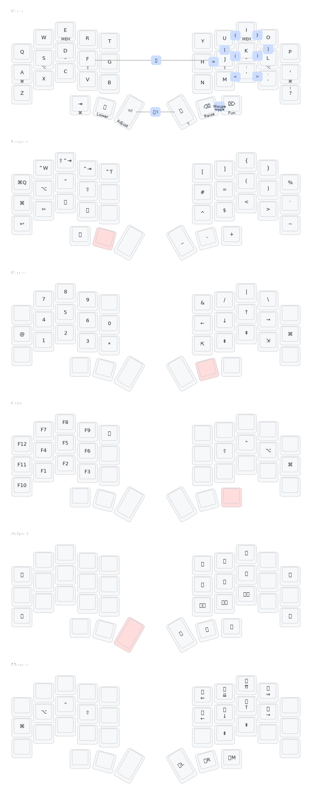

# Folke's ZMK Config

I'm just getting started with split keyboards and ZMK, so this is a work in progress.
My current keyboard is an Aurora Sofle v2, and I'm using a Chocofi (Corne).

## Keymap

## Recent Updates (2024)

This configuration has been updated to work with the latest ZMK firmware:

- Fixed syntax issues (`quick_tap_ms` → `quick-tap-ms`)
- Enabled `hold-trigger-on-release` (now available in ZMK 0.3.0+)
- Added `require-prior-idle-ms` for better home row mods performance
- Using modern ZMK features and best practices

## Features

- **Home Row Mods**: Using urob's timerless homerow mods approach
- **Combos**: Efficient key combinations for common characters
- **Layers**: BASE, LOWER, RAISE, FUN, and ADJUST layers
- **Split Keyboard Support**: Aurora Sofle and Corne with Nice!View displays
- **Modern ZMK**: Compatible with ZMK 0.3.0+ with latest features

## Resources

- [urob](https://github.com/urob/zmk-config): timeless home row mods
- [infused-kim](https://github.com/infused-kim/zmk-config)
- [miryoku_zmk](https://github.com/manna-harbour/miryoku_zmk)
- [ZMK Docs](https://zmk.dev/docs)
- [Designing a Symbol Layer](https://getreuer.info/posts/keyboards/symbol-layer/index.html)
- [A guide to home row mods](https://precondition.github.io/home-row-mods#shift-thumb-keys)
